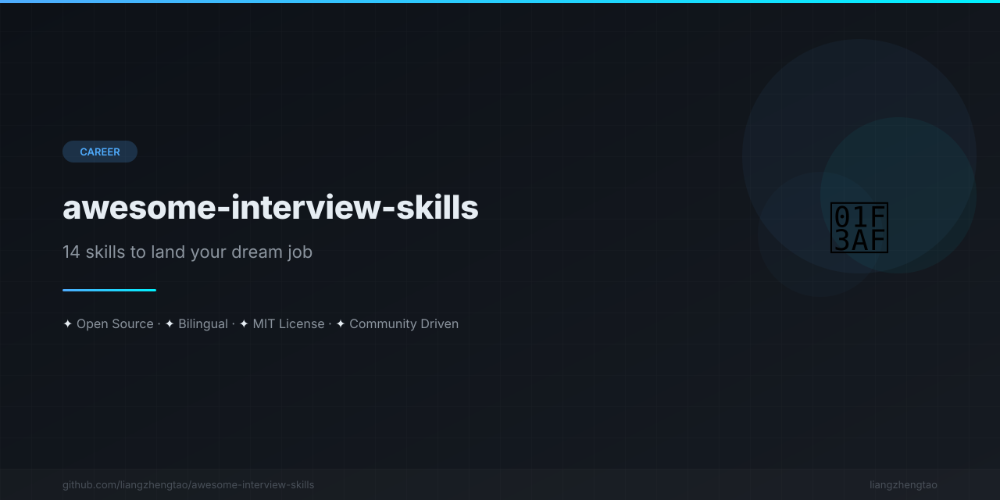

[English](README.md) | [中文](README.zh.md) | [日本語](README.ja.md) | [Français](README.fr.md) | [Español](README.es.md) | [العربية](README.ar.md) | [한국어](README.ko.md) | [Português](README.pt.md) | [Русский](README.ru.md) | [Deutsch](README.de.md)

<div align="center">



</div>


<div align="center">

# 🎯 Awesome Interview Skills

[](https://awesome.re)
[](CONTRIBUTING.md)
[](LICENSE)
[](#tableau-des-compétences)
[](https://github.com/liangzhengtao)

---

### 🚨 Plus d'échecs en entretien. 14 compétences IA pour décrocher un poste en FAANG.

**Avant** : Stress, manque de préparation, réponses décousues, blanc sur les algorithmes, aucune structure.

**Après** : Confiance, réponses structurées, résolution de problèmes par patterns, négociation basée sur les données, offres des meilleures entreprises.

*Ce sont des compétences IA (fichiers `.md`) chargeables dans **Cursor**, **Claude Code**, **Kimi Code**, **Windsurf** ou tout assistant IA de code pour un coaching d'entretien en temps réel.*

---

</div>

### 🏆 Si vous ne lisez que 3 compétences, choisissez celles-ci :

| Priorité | Compétence | Pourquoi |
|----------|-------|-----|
| 🥇 | [Patterns LeetCode](skills/算法面试/leetcode-patterns.md) | 80% des questions de coding suivent 15 patterns. Maîtrisez-les tous. |
| 🥈 | [Méthode STAR](skills/行为面试/star-method.md) | Structurez vos réponses comportementales pour marquer les esprits. |
| 🥉 | [CV technique](skills/简历优化/tech-resume.md) | Le CV est la porte d'entrée. Si l'ATS vous rejette, rien d'autre n'importe. |

### 📋 Tableau des compétences

<details>
<summary><b>🧮 Entretiens d'algorithmes — 4 compétences</b></summary>

| Compétence | Description | Quand l'utiliser |
|-------|-------------|----------|
| [Patterns LeetCode](skills/算法面试/leetcode-patterns.md) | 15 patterns de résolution les plus courants avec modèles | Préparation aux entretiens de code |
| [Fiche mémo structures de données](skills/算法面试/data-structures-cheatsheet.md) | Référence rapide pour toutes les structures principales | Révision avant entretien |
| [Framework d'entretien de code](skills/算法面试/coding-interview-framework.md) | Méthode UMPIRE pour une résolution structurée | Pendant les entretiens de code en direct |
| [Bases de la conception système](skills/算法面试/system-design-basics.md) | Scalabilité, cache, bases de données, théorème CAP | Préparation à l'entretien de system design |

</details>

<details>
<summary><b>🏗️ Conception système — 3 compétences</b></summary>

| Compétence | Description | Quand l'utiliser |
|-------|-------------|----------|
| [Systèmes distribués](skills/系统设计/distributed-systems.md) | Consensus, modèles de cohérence, patterns microservices | Entretiens ingénieur senior |
| [Entretien de conception API](skills/系统设计/api-design-interview.md) | REST, GraphQL, gRPC, versioning, rate limiting | Entretiens de conception API |
| [Conception de bases de données](skills/系统设计/database-design.md) | SQL vs NoSQL, normalisation, indexation, sharding | Entretiens de conception de schéma |

</details>

<details>
<summary><b>🗣️ Entretiens comportementaux — 3 compétences</b></summary>

| Compétence | Description | Quand l'utiliser |
|-------|-------------|----------|
| [Méthode STAR](skills/行为面试/star-method.md) | Framework pour réponses comportementales structurées + 20 questions fréquentes | « Parlez-moi d'une situation où... » |
| [Questions de leadership](skills/行为面试/leadership-questions.md) | Résolution de conflits, constitution d'équipe, délégation, prise de décision | Entretiens manager/directeur |
| [Adaptation culturelle](skills/行为面试/culture-fit.md) | Alignement avec les valeurs de l'entreprise, préparation culture FAANG | Entretiens de fit culturel |

</details>

<details>
<summary><b>📄 Optimisation du CV — 2 compétences</b></summary>

| Compétence | Description | Quand l'utiliser |
|-------|-------------|----------|
| [CV technique](skills/简历优化/tech-resume.md) | Optimisation ATS, quantification des réalisations, modèles pour tous niveaux | Création/mise à jour du CV |
| [Portfolio GitHub](skills/简历优化/github-portfolio.md) | README de profil, repos épinglés, documentation de projets | Construire votre marque de développeur |

</details>

<details>
<summary><b>💰 Négociation salariale — 2 compétences</b></summary>

| Compétence | Description | Quand l'utiliser |
|-------|-------------|----------|
| [Négociation d'offre](skills/薪资谈判/offer-negotiation.md) | Scripts de contre-offre, calcul TC, stratégie d'offres concurrentes | Négocier les offres d'emploi |
| [Évolution de carrière](skills/薪资谈判/career-growth.md) | Dossiers de promotion, évaluations de performance, plan de carrière | Planifier son avancement |

</details>

### 🚀 Démarrage rapide

#### Cursor

1. Clonez ce dépôt ou copiez les fichiers de compétence dans votre projet
2. Dans Cursor, ouvrez un chat et référez la compétence :
   ```
   @skills/算法面试/leetcode-patterns.md Help me solve LeetCode 3
   ```
3. L'IA suivra le framework du fichier de compétence

#### Claude Code

1. Clonez le dépôt :
   ```bash
   git clone https://github.com/liangzhengtao/awesome-interview-skills.git
   ```
2. Référez les compétences dans votre conversation :
   ```
   Read skills/行为面试/star-method.md and help me prepare an answer for "Tell me about a conflict you resolved"
   ```

#### Kimi Code

1. Copiez les fichiers de compétence dans votre répertoire de travail
2. Référez-les dans la conversation :
   ```
   @skills/简历优化/tech-resume.md Review my resume and give feedback
   ```

#### Tout assistant IA

Collez simplement le contenu d'un fichier de compétence dans votre conversation, puis posez votre question. L'IA suivra les frameworks et modèles.

---

## 📖 Fonctionnement de chaque compétence

Chaque fichier de compétence contient :

1. **Quand l'utiliser** — Conditions de déclenchement claires
2. **Concepts clés** — Connaissances fondamentales nécessaires
3. **Framework pas à pas** — Approche structurée
4. **Modèles** — Modèles à compléter avec exemples
5. **Erreurs courantes** — Écueils à éviter
6. **Conseils de pro** — Connaissances d'initiés d'ingénieurs expérimentés
7. **Questions pratiques** — Exercices concrets

## 🤝 Contribuer

Les contributions sont les bienvenues ! Voir [CONTRIBUTING.md](CONTRIBUTING.md) pour les directives.

## 🔒 Sécurité

Voir [SECURITY.md](SECURITY.md) pour notre politique de sécurité.

## 📄 Licence

Ce projet est sous licence MIT — voir [LICENSE](LICENSE) pour les détails.

## 👤 Auteur

**liangzhengtao** — [GitHub](https://github.com/liangzhengtao)

---

## 🔗 Voir aussi

> Autres collections de compétences IA impressionnantes :

- [awesome-interview-skills](https://github.com/liangzhengtao/awesome-interview-skills) — 🎯 Ce dépôt ! 14 compétences IA pour la préparation d'entretiens
- [awesome-ai-writing-skills](https://github.com/liangzhengtao/awesome-ai-writing-skills) — ✍️ Compétences IA pour l'écriture académique et professionnelle
- [awesome-ai-coding-skills](https://github.com/liangzhengtao/awesome-ai-coding-skills) — 💻 Compétences IA pour les workflows de développement logiciel
- [awesome-ai-research-skills](https://github.com/liangzhengtao/awesome-ai-research-skills) — 🔬 Compétences IA pour la recherche et la revue de littérature

---

<div align="center">

**Si ce projet vous a aidé, merci de lui donner une ⭐️**

Made with ❤️ by [liangzhengtao](https://github.com/liangzhengtao)

</div>
